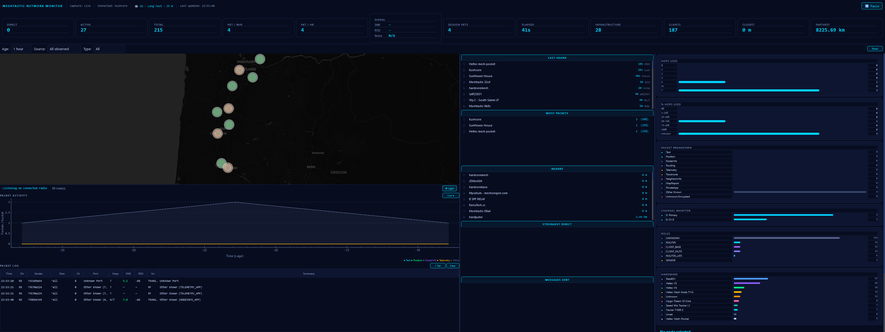
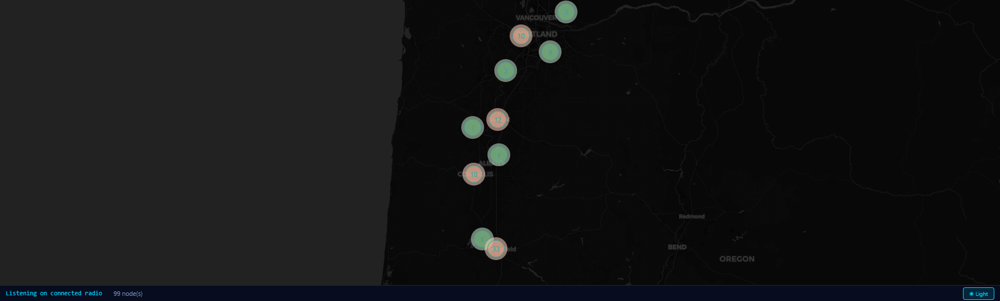
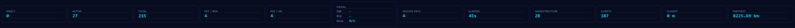
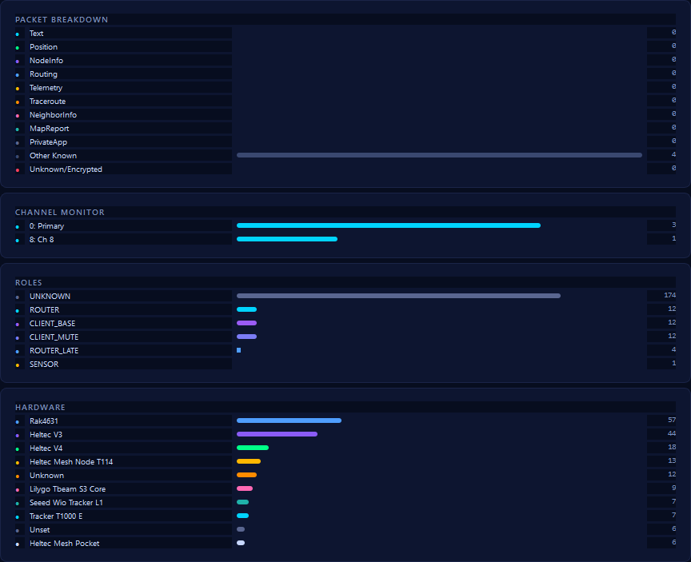
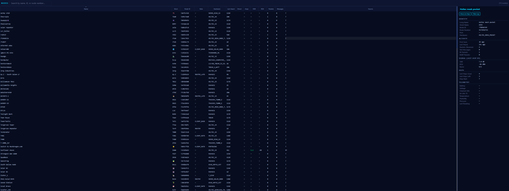
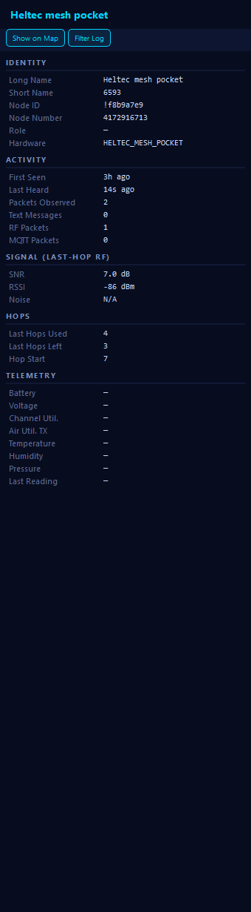
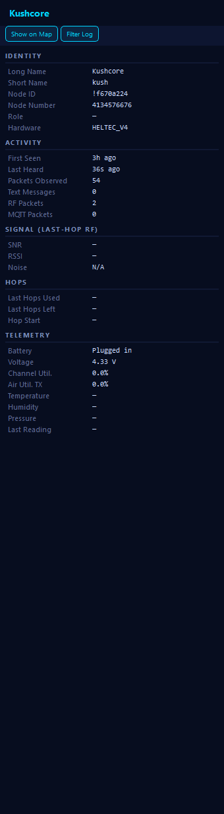

<div align="center">

# MeshChat for Windows

**A native Windows client and deep network monitor for [Meshtastic](https://meshtastic.org) mesh radios.**

Chat with your mesh, then actually *see* it — every node, every packet, every hop.

[](https://github.com/hardcoreerik/MeshChat-Windows/releases)
[](LICENSE)
[](https://github.com/hardcoreerik/MeshChat-Windows/releases)
[](https://www.python.org/)

</div>



---

## What this is

MeshChat connects to **one** Meshtastic radio over USB, Bluetooth, or Wi-Fi.
The radio — not the PC — sends and receives the actual LoRa packets. MeshChat
gives you a chat client on top of it, plus a monitoring dashboard that surfaces
what the mesh is really doing: who's reachable, how many hops away, what's
relaying, and how the signal looks.

It's a desktop app, not a web service. Nothing is uploaded anywhere; all
history lives in a local SQLite database on your machine.

---

## Features

### 🗺️ Live mesh map

Every node your radio knows about, plotted and clustered. Populated from the
radio's own node database the moment you connect — plus locally persisted
history, so the map isn't empty before you've connected anything. Light and
dark basemaps.



### 📊 Network monitor

Twelve live KPI cards covering node counts, packet rates, signal, session
totals, and distance extremes. The header shows the radio's actual LoRa
configuration — region, modem preset, and channel.



Alongside them: rankings (last heard, most packets, nearby/farthest, strongest
signal, messages sent), a live packet-activity chart, a full packet log, and
distribution panels breaking traffic down by type, channel, node role, and
hardware model.



### 🔵 Node table and inspector

Every node, sortable and searchable, with a detail panel covering identity,
activity, last-hop RF signal, hop counts, and telemetry.



Right-click any node to message it, show it on the map, request its position or
telemetry, run a traceroute, favorite it on the radio, or remove it from the
radio's node database.

<table>
<tr>
<td width="50%" valign="top">

**Signal and hops** — SNR, RSSI, and hop-by-hop reach for a node heard over RF.



</td>
<td width="50%" valign="top">

**Telemetry** — battery, voltage, channel utilization, air-time, and
environment sensors when a node reports them.



</td>
</tr>
</table>

### 💬 Chat

Channel messaging across the radio's configured Meshtastic channels, direct
messages to any reachable node, and local message history that survives
restarts — Meshtastic radios don't store message history themselves, so
MeshChat keeps its own.

### 📶 Spectrum *(optional — needs an RTL-SDR)*

A waterfall view of raw RF energy in the LoRa ISM bands. This shows *that*
activity is happening and where in the band — it does **not** decode LoRa
packets. Requires an RTL-SDR dongle plus `pyrtlsdr` and the native librtlsdr
driver; MeshChat runs normally without any of that.

---

## Install

**Just want to run it?** Grab the latest build from
[Releases](https://github.com/hardcoreerik/MeshChat-Windows/releases), extract,
and run `MeshChat.exe`. No installer, no Python needed. Windows x64.

**From source** (Python 3.12+ x64):

```powershell
git clone https://github.com/hardcoreerik/MeshChat-Windows.git
cd MeshChat-Windows
.\scripts\bootstrap.ps1
.\scripts\run-dev.ps1
```

---

## Connecting

| Transport | Notes |
|---|---|
| **USB / Serial** | Most reliable. Pick the COM port and hit Connect. |
| **Bluetooth** | Pair the radio in **Windows Settings first** — Meshtastic radios require OS-level pairing before any app can reach them. MeshChat detects this case and offers a shortcut to the Bluetooth settings page. |
| **Wi-Fi / TCP** | Enter the radio's hostname or IP (default port 4403). |

---

## Development

```powershell
.\scripts\test.ps1          # run the test suite
.\scripts\build.ps1         # build dist\MeshChat\MeshChat.exe
.\scripts\run-dev.ps1 -Debug   # verbose logging
```

Logs are written to `%LOCALAPPDATA%\MeshChat\Logs\`.

**Architecture** — PySide6 (Qt 6) desktop app. All blocking Meshtastic I/O runs
on a dedicated `QThread`; the radio library's PubSub callbacks are marshalled
back to the GUI thread as Qt signals, so widgets are only ever touched from the
main thread. Packets flow through a single deduplicating ingestion pipeline
before reaching the UI or the SQLite store. The map is Leaflet in a
`QWebEngineView`, bridged over `QWebChannel`.

---

## Roadmap

- MeshCore network support alongside Meshtastic
- Editing LoRa region/preset from the app (with appropriate guard rails —
  region selection has real RF-regulatory meaning)
- Compact image transmission over the mesh — see
  [docs/mcoreimg-integration.md](docs/mcoreimg-integration.md)

## Status

**Alpha.** It works and it's useful, but expect rough edges. Bug reports and
issues are welcome.

---

## License

GPL-3.0-only — see [LICENSE](LICENSE).

MeshChat links the official Meshtastic Python package, which is GPL-3.0
copyleft, so this project is licensed to match. Full dependency licensing is in
[THIRD_PARTY_LICENSES.md](THIRD_PARTY_LICENSES.md).

Not affiliated with or endorsed by the Meshtastic project.
