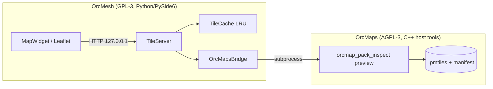
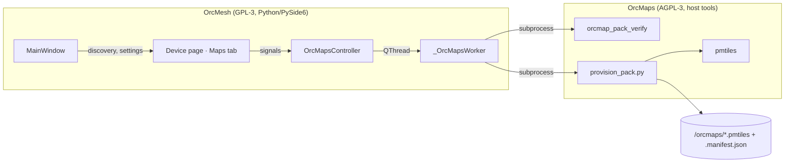

# OrcMaps Integration — Design

Status: **Phase 2 complete** — verified in the running app (offline tiles render
from a local pack, with manifest attribution shown; the Device page lists packs,
verifies a card with OrcMaps' own verifier, and cuts a pin-radius pack onto a
card). Captures the integration of
[OrcMaps](https://github.com/hardcoreerik/orcmaps) (offline map engine, local
clone convention `F:\Ai\OrcMaps`) into OrcMesh. Written after verifying the
seam against the real OrcMaps tree — see "Verified on this machine".

## Goal

Four capabilities, confirmed with the user:

1. **Offline basemap** in OrcMesh's map view — render local `.pmtiles` packs
   instead of today's online Leaflet/OSM raster tiles. *Offline is a hard
   requirement: the desktop map must work with no internet at all.*
2. **Pack manager / provisioner** — build, verify, inspect packs and write
   them to a radio's SD card from OrcMesh's Device page.
3. **Node overlays** on the OrcMaps basemap, plus exporting overlays for the
   device to draw.
4. **Map/pack data over the LoRa mesh** — see the risk note; this needs its
   own design pass before implementation.

## The boundary: separate process, never linked

OrcMaps is **AGPL-3.0-only** (dual-licensed commercial); OrcMesh is
**GPL-3.0-only**. GPL-3 §13 permits combining them, but the combined work then
carries AGPL's network-source obligations. So OrcMesh **does not link, vendor,
or copy OrcMaps code** — it runs OrcMaps' host tools as child processes and
talks to them through files, exit codes, and stdout. That keeps each project's
license intact and lets either be relicensed independently.

Two consequences that are design constraints, not preferences:

- OrcMesh must degrade gracefully when the tools aren't built (`find_tools()`
  returns None + a reason; the UI explains how to build them).
- OrcMaps' **provenance/licensing model is mandatory**, not advisory. Any pack
  OrcMesh surfaces must come with its manifest, and `required_attribution`
  must be displayed wherever that basemap is shown (`docs/PACK_MANIFEST_SCHEMA.md`
  → "the exact list of attribution strings the runtime should surface").
  OrcMesh must never invent pack metadata or fetch source data itself.

## Verified on this machine

| Fact | Value |
|---|---|
| Render CLI | `build-pack-inspect\Release\orcmap_pack_inspect.exe` (already built) |
| Verify CLI | `build-pack-verify\Release\orcmap_pack_verify.exe` |
| Render command | `orcmap_pack_inspect preview <archive> --lat --lon --zoom --width --height --out <file.ppm> [--style id]` |
| Output format | binary P6 PPM |
| Measured latency | **45 ms cold / 27 ms warm** for 256×256 (80 MB `oregon.pmtiles`) |
| Builtin style ids | `orcsdr-dark`, `standard-light`, `high-contrast-field`, `night-red-safe` |
| Packs on hand | `oregon.pmtiles` (z1–13, 80 MB), `springfield-97477`, `pin-25km/50km/100km`, `wizard-demo` |
| World overview | `world-overview.pmtiles` (z0–8, 16.4 MB) built from Natural Earth 5.1.2 — `class: clean`, priority 0, **no required attribution** (public domain, link recorded) |
| Pin cutter | `tools/pack-builder/provision_pack.py` (host-only Python) |
| pmtiles CLI | `data/local/tools/go-pmtiles/<version>/pmtiles.exe` (pinned copy in the checkout) |
| Measured build | **0.6 s** to cut a real 3 km pin pack, then verified by `orcmap_pack_verify` |
| Verify output | `RESULT: OK -- all 1 pack(s) would install.` on success; `RESULT: NO USABLE PACKS` is a *result*, not an error |

At ~30–45 ms/tile, a full viewport (≈6×3 tiles) costs well under a second cold
and is instant once cached — so **v1 renders per request with an LRU cache**,
no persistent daemon. If panning ever feels slow, the upgrade is a long-lived
`stdin/stdout` JSON-lines renderer rather than a different architecture.

## Contracts mirrored from OrcMaps (do not soften)

From `docs/SD_CARD_LAYOUT.md` and `docs/PACK_MANIFEST_SCHEMA.md`:

- A pack is a **stem-paired** triplet: `<name>.pmtiles` + `<name>.manifest.json`
  (+ optional `<name>.sha256`). A manifest never contains a path.
- **An archive without a manifest is invisible.** A manifest without its
  archive is reported and skipped. Manifests over 64 KiB are refused.
- `min_zoom`/`max_zoom` and `bounds` come from the manifest; the archive's own
  header is the other half of the truth (`pack-verify` warns on disagreement).
- Installability is checked by running the **same** `DiscoverPacks()` the
  firmware runs — i.e. by calling `orcmap_pack_verify`, never by
  re-implementing the rules in Python. OrcMesh's own discovery (for listing
  packs to render) mirrors only the pairing rules, which are stable and
  documented.

## Architecture (Phase 1)

- `TileServer` binds **127.0.0.1 only**, on an ephemeral port, and serves
  `/tiles/{z}/{x}/{y}.png`. Loopback HTTP (not a custom URL scheme) because
  QtWebEngine custom schemes must be registered before `QApplication` exists,
  and the page already fetches remote URLs.
- Tiles are rendered to PNG in Python from the CLI's PPM output, then cached.
- **Pack selection mirrors OrcMaps' `ResolvePack()`, and the distinction is
  load-bearing.** A pack that *fully contains* the tile wins outright, highest
  `priority` first. A pack whose bounds merely *overlap* the tile is only used
  when nothing contains it. 404 outside all packs, so Leaflet shows no broken
  tiles.

  Why it has to be containment, not overlap: a city pack's bounds overlap a z2
  tile but cannot contain it. Under a plain overlap rule the city pack won on
  `priority` and painted a near-empty tile over every low-zoom view — measured
  on this machine, the world overview's z2 tile rendered 2121 bytes of real
  geography where the city pack rendered 1700 bytes of almost nothing. OrcMaps
  avoids this by requiring a pack to cover the requested area completely, so
  OrcMesh matches it. The overlap fallback exists so an install holding only a
  regional pack keeps rendering its edges instead of showing a blank map.
- **An empty render falls through to the next pack.** Bounds are rectangles, so
  a pack can *claim* tiles its archive has no data for. Measured with the US
  pack installed: central Canada sits inside its box, and the US pack served a
  completely flat tile (0.0% of pixels inked) where the world overview has 20%.
  So the tile server tries candidates in resolver order and keeps the first one
  that produces a non-flat frame, caching the "nothing here" decision for the
  ones it rejected — the retry is paid once per tile, never again. This is an
  OrcMesh-side mitigation for a limitation OrcMaps documents as future work
  (its `ResolvePack()` has the same rectangular-coverage gap).
- **The whole installed pack set is served, not just the chosen pack.** OrcMaps
  resolves a pack *per view*, not per install, so a world overview can only
  cover the low zooms if it is in the set being served. Selecting a pack in
  `Map → Basemap Source` therefore makes it the *preferred* pack (first on ties)
  rather than the only one, the zoom clamp sent to Leaflet is the union across
  the set (else the map cannot be zoomed out to the overview), and the credit
  line is the union of the served packs' `required_attribution` — a tile may
  come from any of them, and crediting only the chosen one would drop a licence
  obligation.
- The app's existing light/dark map toggle maps to OrcMaps style ids:
  dark → `orcsdr-dark`, light → `standard-light`.

## Architecture (Phase 2)

- One `QThread` and one worker; every output line is streamed to the UI so a
  long build is observable, and completion arrives as
  `(operation, success, detail)`.
- **Unlike `FirmwareController`, these operations are cancellable.** The child
  `Popen` is retained, so `cancel()` — and therefore `closeEvent` — terminates a
  stuck external tool instead of blocking exit on it. `cancel()` is called
  directly rather than through a queued connection: the worker's thread is
  blocked inside the child, so a queued slot would not run until the very work it
  is meant to interrupt had finished.
- MainWindow owns discovery (the packs, the tools, the reason when there are
  none) and pushes results into the view; the Device page never shells out.

## Phases

**Phase 1 — offline basemap. DONE, verified in the running app.**
- `services/orcmaps.py`: tool discovery (degrades to a reason string, never
  raises), pack/manifest discovery mirroring OrcMaps' pairing rules, Web
  Mercator tile math, render via the CLI, a stdlib PPM→PNG encoder, and a
  loopback-only tile server with an LRU cache and a `/status` endpoint.
- `Map → Basemap Source…` switches between the online basemap and any
  discovered pack; the choice persists in QSettings and is restored at startup.
  The theme maps to `orcsdr-dark` / `standard-light`, and a style change bumps a
  cache-busting `?v=` revision so Leaflet refetches instead of showing the old
  style's cached pixels.
- The manifest's `required_attribution` is drawn on the map (ODbL) and echoed
  in the status bar; the attribution control's text is escaped, and only
  http(s) links are made clickable.
- *Acceptance:* with an offline pack selected the basemap comes from
  `127.0.0.1` (log + HTTP verified) and the online layers are never added to the
  map, so no network is used for the basemap.

**Lesson from Phase 1 worth keeping:** the cache-busting `?v=` revision made
every tile 404, because the server split the *raw* request path and so failed
its own `.png` check on `185.png?v=1`. Unit tests passed because they fetched a
query-less URL. Anything the browser fetches has to be verified with the exact
URL the browser sends.

**Phase 2 — pack manager. DONE.** The Device page gained a `Maps` tab
(`services/orcmaps.py` + `controllers/orcmaps_controller.py`):
- **List** every discovered pack with zoom range, size, region, `pack_class`,
  and the manifest's `required_attribution` — attribution is shown in the UI as
  well as on the map, because a pack's credit is not only a rendering concern.
- **Verify** any card root or pack directory with `orcmap_pack_verify` — the
  same `DiscoverPacks()` the firmware runs, never a Python re-implementation.
- **Cut a pack around a point** via `provision_pack.py`, staged straight into
  `<card>/orcmaps/`. Defaults to a **preview** (`--dry-run`).

Four decisions worth keeping:

1. **`provision_pack.py` was chosen over
   `tools/pack-builder/build_regional_pack.py`** precisely because it *derives*
   the ~25 provenance flags (source snapshot, schema, attribution, pack class)
   from the **source pack's manifest** instead of asking an operator to retype
   them. Retyping is how a wrong source snapshot or a missing credit gets
   recorded. OrcMesh supplies only the pin, radius, name, and the OrcMaps commit
   doing the build. Building a regional pack from upstream data is **not** wired
   up — that would make OrcMesh fetch source data, which the boundary forbids.
2. **A card root and a pack directory are different things.** A user picks a
   card root in a file dialog; the verifier only understands the pack directory
   inside it (`<card>/orcmaps/`). `resolve_pack_directory()` converts, so a good
   card is never reported unusable.
3. **The builder commit is read, never invented.** `provision_pack.py` requires
   `--builder-commit`; `checkout_commit()` reads it from the checkout and
   **refuses the build** when it cannot (a non-git directory), rather than
   writing a pack with a false provenance record.
4. **A built pack is verified before it is called done.** The controller runs
   `orcmap_pack_verify` over the staged layout and reports failure if OrcMaps'
   own discovery would not install it. A `--dry-run` preview is exempt — it cut
   nothing, so verifying it would report "no usable packs" for a run that worked
   exactly as asked.

- *Acceptance:* the pack table lists the real packs with attribution; a pack
  staged into a card root verifies `OK`; a preview cuts nothing and leaves the
  card untouched.

**Lesson from Phase 2 worth keeping:** `subprocess` returns an exit status, and
status `0` means success — but in Python `0` is falsy, so returning the raw code
from a helper made **every successful build read as a failure**. Success values
have to be normalised (`code == 0`) before they reach a caller that tests
truthiness. The same class of bug hides in Qt's `setEnabled(x is not None)`
style checks: a busy-state toggle that unconditionally re-enabled every button
resurrected "Verify" even when OrcMaps' tools were missing, offering a control
that could only fail.

**Phase 3 — overlays.** Feed mesh nodes (positions already in `MonitorStore`)
into the render as OrcMaps overlay primitives so the offline render shows them
natively, and export node/waypoint overlays for the device (`src/overlays` is
still planned on the OrcMaps side — this phase may need work in both repos).

**Phase 4 — over the mesh (needs its own design pass).** A full pack over LoRa
is not viable: an 80 MB regional pack at realistic Meshtastic throughput is
days of airtime, and `PROJECT_TRUTH.md` is explicit that the network may
*deliver* packs but is never part of runtime map operation. What is plausible
is small **overlay/waypoint deltas** (the same insight OrcMesh's
`mcoreimg-integration.md` reached about a generic compact-data channel). Do not
start this without a bandwidth budget and an agreed payload class.

## Open questions

- Where does OrcMesh expect OrcMaps to live in a shipped install? Today
  `find_tools()` probes an env var, the sibling-directory convention (this
  workspace), and `F:\Ai\OrcMaps`. A packaged app needs an explicit setting.
- Should OrcMesh bundle *packs*, or only manage them? Bundling drags map-data
  licensing (ODbL attribution/share-alike) into the installer — a separate
  decision from engine licensing.
- Renderer output is labels-free today (`STATUS.md`), so a desktop basemap
  from OrcMaps will look sparser than OSM raster tiles. That is expected, not
  a bug to work around.
- **The cut flow trusts whatever directory is chosen as a "card root."** Nothing
  checks that the destination is a mounted card, or that it has room for the
  pack: picking a desktop folder stages `orcmaps/` into it. Cheap guards would be
  a warning when the destination has no `orcmaps/` directory yet, and a free-space
  check against the built pack's size.
